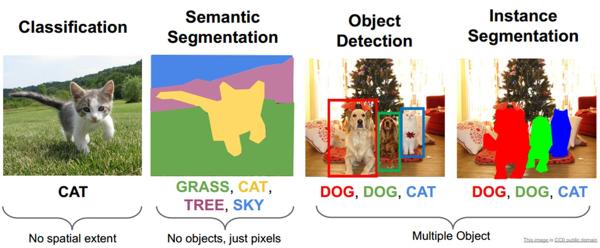
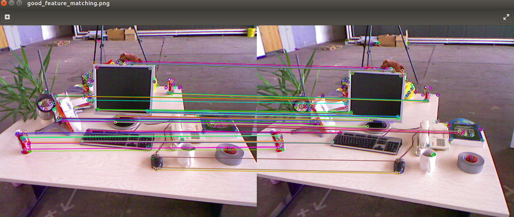
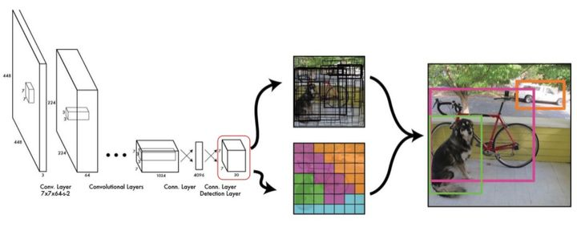

### 什么是计算机视觉？

首先这里引用一下维基百科的定义：

> **Computer vision** is an [interdisciplinary scientific field](https://en.wikipedia.org/wiki/Interdisciplinarity) that deals with how [computers](https://en.wikipedia.org/wiki/Computer) can gain high-level understanding from [digital images](https://en.wikipedia.org/wiki/Digital_image) or [videos](https://en.wikipedia.org/wiki/Video). From the perspective of [engineering](https://en.wikipedia.org/wiki/Engineering), it seeks to understand and automate tasks that the [human visual system](https://en.wikipedia.org/wiki/Human_visual_system) can do.

计算机视觉研究的是计算机如何从数字图像或视频中获得高层次的理解，我们期望达到的是，机器能像我们人类一样，对一幅图像能有着直接的感知。

其中比较火热的方向有图像分类、图像检测、语义分割等。

其中图像分类力求机器能够知道一幅图片中的物体是什么，是人？还是狗，还是其他的物体。

而图像检测则更进一步、它力求机器能够知道一幅图像中的物体是什么，并且在图片中的具体位置。

而语义分割则力求机器知道每一个像素点都隶属于哪一个类别。

各类任务

众所周知、在计算机中是用矩阵来存储图像数据的、矩阵中的每个元素也就是图片中的每一个像素点。

我们可以发现的是，从图像分类->图像检测->语义分割这个过程，我们解决的问题一步步的深入、我们从感知一张图片的概况、转为感知一张图片部分区域的情况、进而想要感知每个像素点的情况。

值得说道的是，在以上提到的各个领域、机器在准确率方面均已超越了人类的平均水平。

### 视觉组需要做什么？

在我们参加的各类比赛中，有着许许多多的视觉任务。

如踢球比赛，我们想要踢球、想要跟对方对抗，我们首先要感知到对方的位置以及球的位置。

如RoboMaster比赛，我们需要击打敌方机器人的装甲板，我们就需要能够准确识别对方装甲板的位置、从而协助上层进行策略等方面的对抗。

在我们的比赛过程中，我们常常需要解决的是目标识别检测领域的问题。

目前基地分为两类方向来达成此目的

1. 利用 OpenCV 对需要识别的物体进行特征提取、利用特征建立约束集从而完成对目标的检测。
2. 基于深度学习、利用端到端的神经网络来对目标进行识别与检测。

角点特征提取

yolo目标检测

以上两种方法各有优劣，前者一般而言效率比较高、对硬件要求小。而后者体积庞大，对硬件要求较高。

整体而言，因为比赛硬件平台等各种因素的限制，基地目前主流的技术仍是第一种方法、基于 OpenCV 特征约束集的传统方法。

我们在接下来的学习指导中也会涉及这两方面的内容，其中以第一部分为重、对于第二部分我们暂作了解，给出参考资料，希望有心的同学能够继续深入学习。

